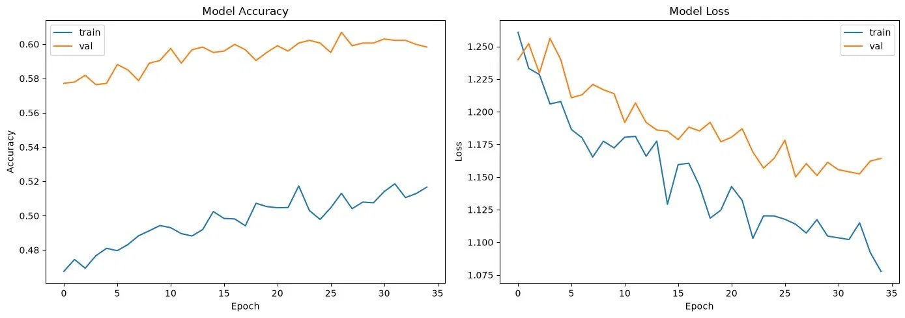
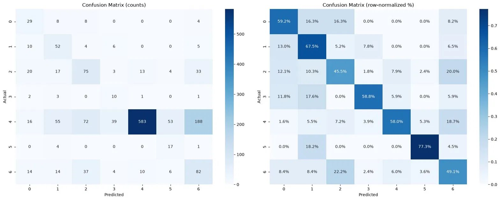

# Skin Cancer Detection — HAM10000 (EfficientNetB3, Transfer Learning)

Multi-class classification of dermatoscopic skin lesions into 7 diagnostic categories using transfer learning on EfficientNetB3, with explicit handling for the heavy class imbalance in the HAM10000 dataset.

> **Disclaimer:** This is an educational project, not a diagnostic tool. It must not be used for real medical decisions.

## Problem

[HAM10000](https://www.kaggle.com/datasets/kmader/skin-cancer-mnist-ham10000) contains 10,015 dermatoscopic images across 7 lesion classes:

| Index | Code | Lesion |
|-------|------|--------|
| 0 | akiec | Actinic Keratoses / Intraepithelial Carcinoma |
| 1 | bcc | Basal Cell Carcinoma |
| 2 | bkl | Benign Keratosis-like Lesions |
| 3 | df | Dermatofibroma |
| 4 | nv | Melanocytic Nevi |
| 5 | vasc | Vascular Lesions |
| 6 | mel | Melanoma |

The dataset is severely imbalanced — `nv` alone is ~67% of all images, while `df` is under 2%. A model that always predicts `nv` scores ~67% accuracy while being clinically useless, so overall accuracy is a misleading metric here; per-class recall (especially melanoma recall) is what matters.

## Approach

- **Transfer learning:** EfficientNetB3 pretrained on ImageNet, used as a frozen feature extractor, then fine-tuned.
- **Two-phase training:** Phase 1 trains only the classification head with the backbone frozen; Phase 2 unfreezes the top backbone layers and fine-tunes end-to-end at a 10x lower learning rate.
- **Correct input scaling:** images are passed through EfficientNet's `preprocess_input` (which expects raw 0–255 pixels), not rescaled to [0,1]. Feeding [0,1] pixels to EfficientNet silently destroys the pretrained features.
- **Class imbalance:** handled via per-sample weights folded directly into the `tf.data.Dataset` as `(image, label, sample_weight)` triples, with weights capped at 5x to avoid destabilizing the loss on the rarest classes. No data duplication / oversampling.
- **Lazy `tf.data` pipeline:** resizing and preprocessing happen per-batch, keeping memory flat.
- **Augmentation:** flips, rotation, zoom, translation, and contrast jitter baked into the model graph (active only during training).
- **Callbacks:** `EarlyStopping` + `ReduceLROnPlateau` + `ModelCheckpoint`.
- **Evaluation:** full per-class precision/recall/F1 and confusion matrix, not just accuracy.

## Results

Trained on the 28×28 HAM10000 variant (see *Limitations*). Test set (n = 1503):

| Metric | Value |
|--------|-------|
| Accuracy | 0.564 |
| Macro F1 | 0.419 |
| Macro recall | 0.593 |
| Melanoma (`mel`) recall | 0.491 |

Per-class recall ranges from ~0.45 (`bkl`) to ~0.77 (`vasc`). The model learns genuine signal across all seven classes rather than collapsing to the majority class — accuracy is *lower* than the 0.67 majority-class baseline precisely because the model is no longer ignoring minority classes.




Full per-class report: [`assets/classification_report.txt`](assets/classification_report.txt).

## Limitations & next steps

- **Resolution is the main bottleneck.** These results use the 28×28 pixel version of HAM10000 upscaled to 224×224, which is mostly interpolation noise — the fine lesion texture that separates `mel` from `bkl` from `nv` largely doesn't survive at 28px. The notebook includes a `load_from_folder()` path for the original full-resolution JPEGs, which is the single highest-leverage change for improving melanoma recall.
- Melanoma recall (~0.49) is far below a clinically deployable bar; this is a learning project, not a medical product.
- Possible improvements: full-resolution images, a larger backbone, test-time augmentation, threshold tuning to prioritize melanoma recall, and stratified k-fold cross-validation for more stable estimates.

## Setup

```bash
git clone https://github.com/Coderyash05/skin-cancer-detection.git
cd skin-cancer-detection
pip install -r requirements.txt
```

The dataset downloads automatically via `kagglehub` on first run (requires Kaggle credentials configured). Then open and run the notebook top to bottom:

```bash
jupyter notebook notebooks/Skin_Cancer_Detection.ipynb
```

Run cells in order in a single kernel session (Restart Kernel + Run All is safest). The trained model (`.keras`) is not committed — it regenerates when you run the notebook.

## License

MIT — see [LICENSE](LICENSE).
