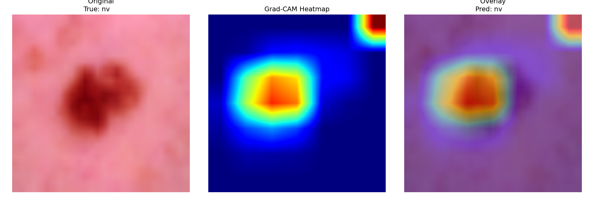

# Skin Cancer Detection (HAM10000)

A 7-class skin lesion classifier built on EfficientNetB3 with transfer learning. The interesting part of this project wasn't the architecture — it was getting a model that had completely collapsed to actually learn, and then being honest about where it tops out.

> This is a learning/portfolio project. It is **not** a medical tool and should never be used for real diagnosis.

🔗 **[Try the live demo](https://huggingface.co/spaces/Coderyash05/skin-lesion-classifier)** — upload a dermatoscopic image, get a prediction across all 7 classes, plus a Grad-CAM overlay. *(Update this link once the Space is deployed.)*

## The dataset

[HAM10000](https://www.kaggle.com/datasets/kmader/skin-cancer-mnist-ham10000) — 10,015 dermatoscopic images, 7 classes:

| Index | Code | Lesion |
|-------|------|--------|
| 0 | akiec | Actinic keratoses / intraepithelial carcinoma |
| 1 | bcc | Basal cell carcinoma |
| 2 | bkl | Benign keratosis-like lesions |
| 3 | df | Dermatofibroma |
| 4 | nv | Melanocytic nevi |
| 5 | vasc | Vascular lesions |
| 6 | mel | Melanoma |

The catch with this dataset is the imbalance. `nv` is about 67% of everything, `df` is under 2%. So a lazy model that just predicts "nv" every single time gets ~67% accuracy while being useless. That's exactly the trap I fell into at first, which is why I don't report accuracy as the headline number — per-class recall, especially melanoma recall, is what actually matters here.

## What I did

- **EfficientNetB3** pretrained on ImageNet, used as a frozen feature extractor first, then fine-tuned.
- **Two-phase training** — train the classification head with the backbone frozen, then unfreeze the top backbone layers and fine-tune at a much lower learning rate.
- **Per-sample class weighting** folded into the `tf.data` pipeline as `(image, label, weight)` triples, capped at 5x so the rarest classes don't blow up the loss. No oversampling/duplication.
- Augmentation (flips, rotation, zoom, contrast) baked into the model graph, active only at training time.
- EarlyStopping, ReduceLROnPlateau, ModelCheckpoint.
- Grad-CAM for explainability.

### The bug that mattered

The first version trained and then predicted `nv` for every single test image — 100% recall on nv, 0% on the other six classes, accuracy frozen at exactly 0.669 (the nv fraction). Classic collapse.

The cause turned out to be input scaling. EfficientNet's `preprocess_input` expects raw 0–255 pixels and normalizes internally, but I was dividing by 255 first and handing it [0,1] values. That quietly wrecks the pretrained features, and once the features are garbage the only way for the head to reduce loss is to predict the majority class forever. Removing the rescale and letting `preprocess_input` do its job is what brought the model back to life. There were a couple of smaller fixes too (the augmentation layer was accidentally outside the model graph), but the scaling one was the killer.

## Results

Test set (n = 1503):

| Metric | Value |
|--------|-------|
| Accuracy | 0.564 |
| Macro F1 | 0.419 |
| Macro recall | 0.593 |
| Melanoma recall | 0.491 |

Accuracy is *lower* than the 0.669 majority baseline, and that's the point — the model is no longer ignoring the minority classes. Every class gets nonzero recall, the confusion matrix has a real diagonal, and per-class recall runs from ~0.45 (bkl) up to ~0.77 (vasc).


Train accuracy sits a bit *below* val accuracy, which threw me at first — but that's the augmentation doing its job (train sees distorted images, val sees clean ones). No overfitting; the train/val loss gap stays small and stable.


Full per-class numbers: [`assets/classification_report.txt`](assets/classification_report.txt).

## Explainability (Grad-CAM)

To check the model wasn't cheating off some background artifact, I ran Grad-CAM on test images. The heatmap lands on the lesion itself rather than the surrounding skin, which is what you want to see:



(There's a small secondary hotspot in the corner on some images — most likely a lighting/border artifact from the dermatoscope. Worth being upfront about rather than pretending the attention is perfect.)

## Where it tops out

The honest ceiling on this is image resolution. A lot of my experiments used the 28×28 version of HAM10000 upscaled to 224×224, which is mostly interpolation noise — the fine texture that separates melanoma from a benign keratosis just isn't there at 28px. The notebook has a `load_from_folder()` path for the original full-resolution JPEGs, and that's the single biggest lever for pushing melanoma recall past ~0.5.

Things I'd try next:
- Full-resolution JPEGs (the obvious one)
- Threshold tuning to favor melanoma recall, since false negatives are the dangerous error here
- A bigger backbone + test-time augmentation
- Stratified k-fold for more trustworthy numbers

## Running it

### Option A: the web app (fastest)

A Streamlit app (`app.py`) wraps the trained model for quick inference — same preprocessing and Grad-CAM logic as the notebook, no need to run any cells:

```bash
git clone https://github.com/Coderyash05/skin-cancer-detection.git
cd skin-cancer-detection
pip install -r requirements.txt
streamlit run app.py
```

It expects `skin_cancer_efficientnet_final.keras` (the trained model) sitting next to `app.py`. See [`app.py`](app.py) for env vars to load the model from Hugging Face Hub instead.

### Option B: the full notebook (training / exploration)

```bash
git clone https://github.com/Coderyash05/skin-cancer-detection.git
cd skin-cancer-detection
pip install -r requirements.txt
```

The dataset pulls automatically through `kagglehub` on the first run (you'll need Kaggle credentials set up). Then just run the notebook top to bottom:

```bash
jupyter notebook notebooks/Skin_Cancer_Detection.ipynb
```

Run the cells in order in one kernel session — Restart Kernel + Run All is the safe move. The trained `.keras` file isn't committed to this repo, so it's gitignored — running the notebook regenerates it (it comes out to ~43MB, so committing it isn't out of the question if you'd rather skip retraining).

## License

MIT — see [LICENSE](LICENSE).